#数据库数据可视化系统
###系统简介
    本系统主要用于解决数据库数据统计以及可视化问题，支持远程连接数据库展示数据，数据统计制图，原始数据制图，数据筛选，结合地图制图等。
###系统架构
    后台：PHP
    前端：angular + bootstrap + echarts
###功能展示
* 使用DNS+用户名+密码方式远程连接数据库

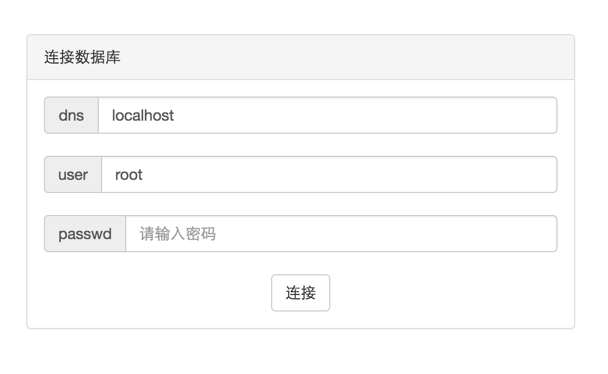

* 选择要查看的数据库和数据表

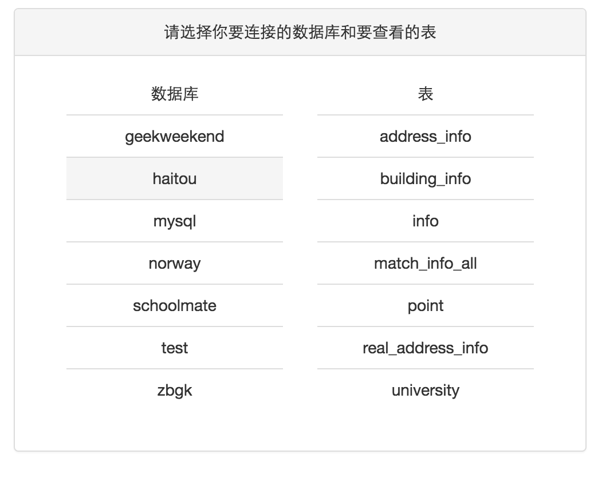

* 展示 localhost 中 norway 数据库的 approve 数据表数据

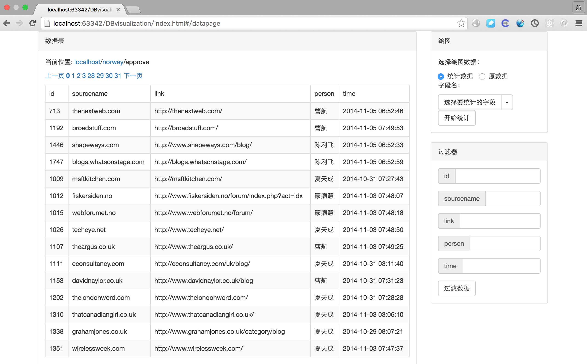

* 使用统计数据功能统计person字段中各个数据出现的次数并绘制成柱状图

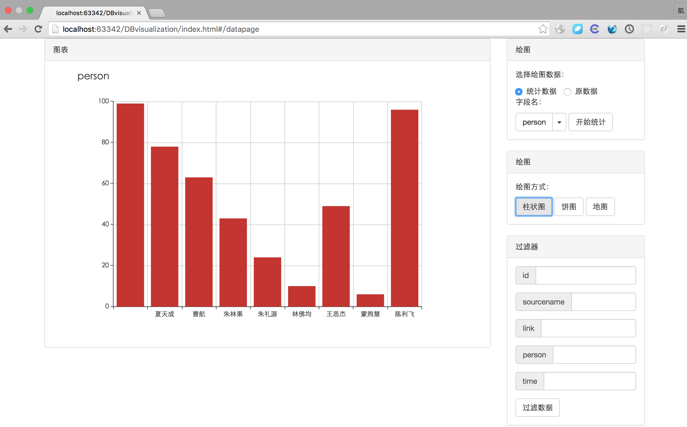

* 绘制饼图

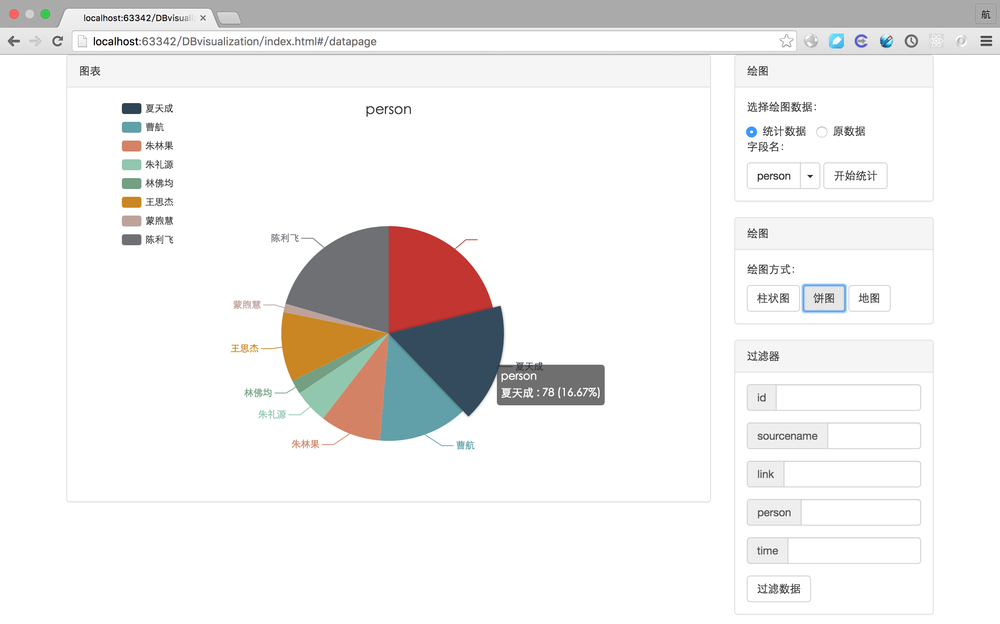

* 展示 localhost 中 zbgk 数据库的 zb_area_score 数据表数据

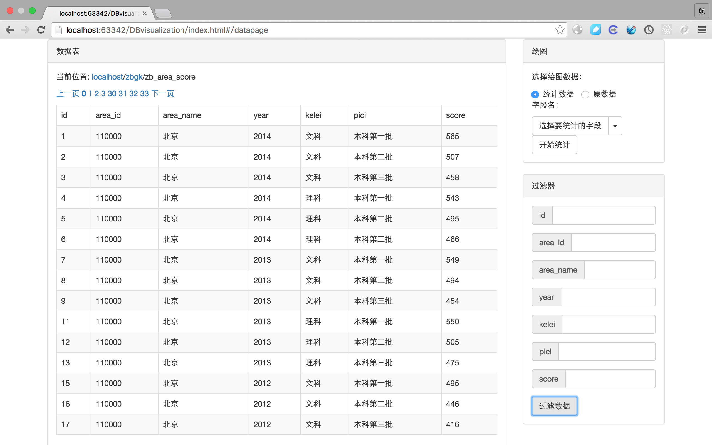

* 使用过滤器功能筛选出 year = 2014 , kelei = 文科 , pici = 本科第一批 的数据 

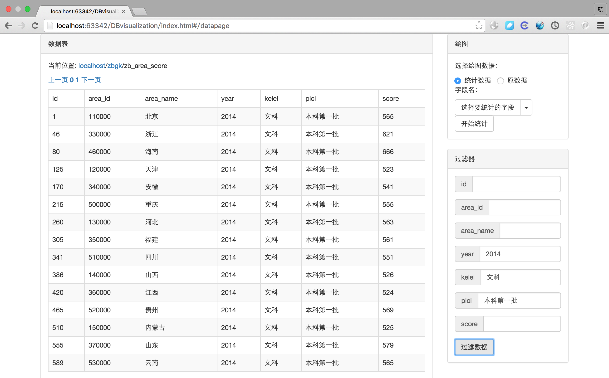

* 将筛选后的数据选择X轴和Y轴绘制成柱状图 

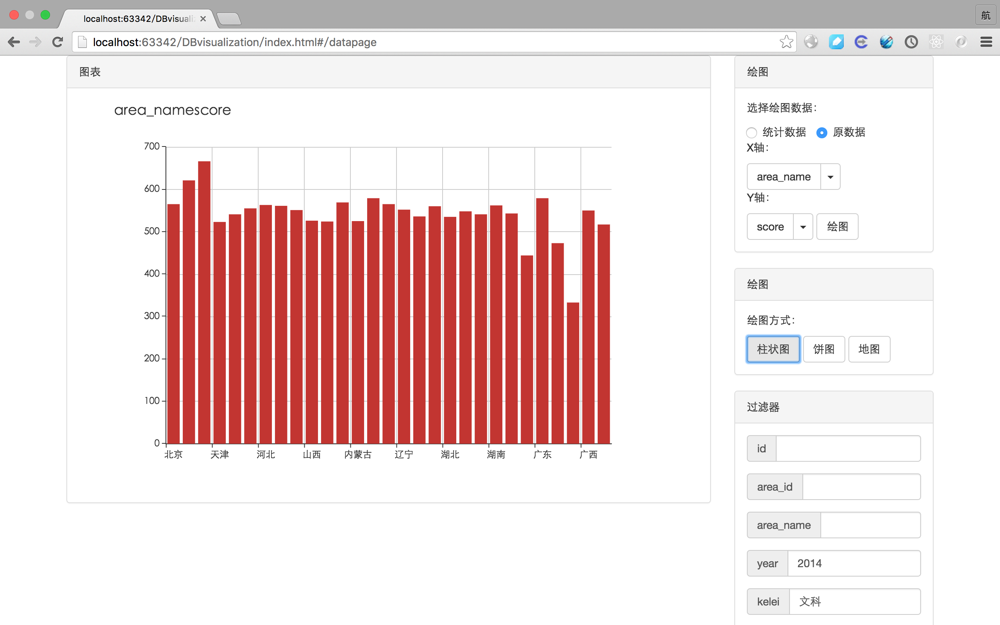

* 绘制成饼图

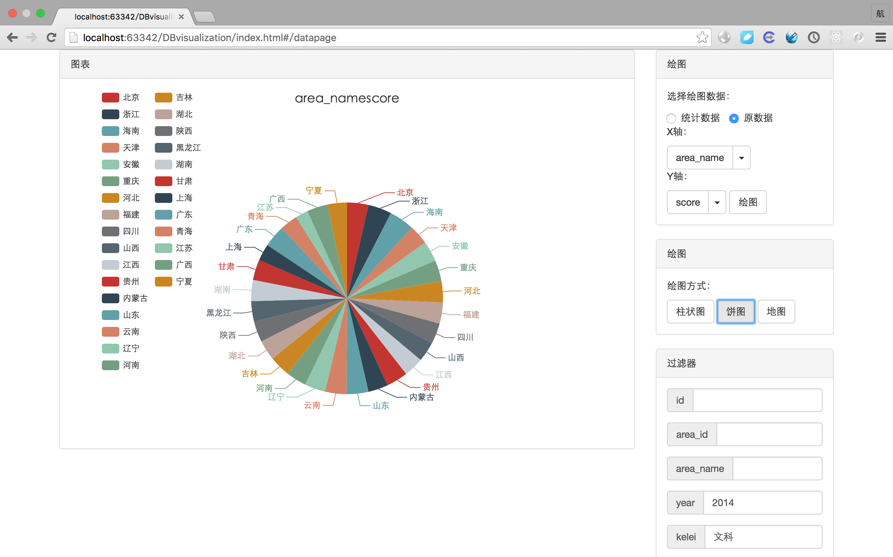

* 在地图上展示 

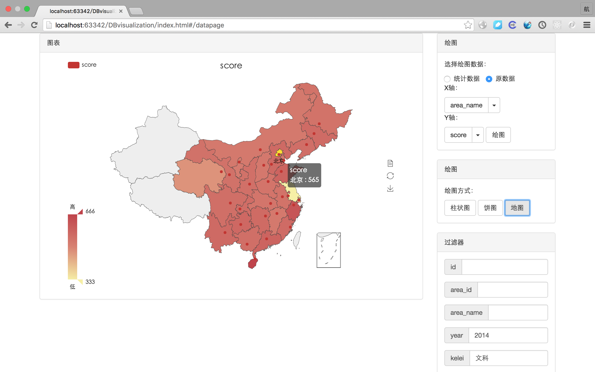

* 使用筛选器功能筛选出kb = 文科 ，lqpc = 本科1批 ，pjf > 600 的数据

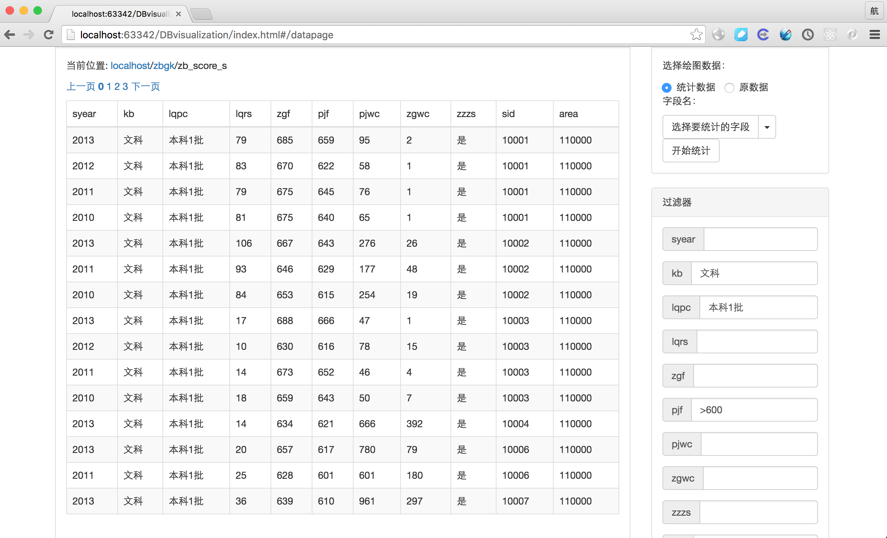

